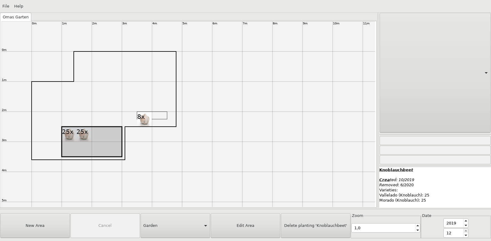

# GardenPlanner (version 0.0.0-alpha)
A tool for the documentation of vegetable gardens and vegetable varieties.
It allows to document the location of plantings for each month/year and is intended to help with the planning of the crop rotation. It can also document typical
actions in the garden such as the application of compost at a specific area. Furthermore, it can save information about vegetable varieties and use this info to give
automatic suggestions for future plantings with this variety (e.g. based on the varieties' best sowing dates).

> 
>Shows my garden in the winter (december 2019) with two garlic plantings. The larger planting is selected and in the bottom right its information is shown.
>25 cloves of two different garlic varieties were planted in october 2019 and harvested in june 2020.
>(garlic image used in screenshot: [Garlic whole](https://commons.wikimedia.org/wiki/File:Garlic_whole.jpg) by [Amin](https://commons.wikimedia.org/wiki/User:Amin),
licensed under [CC-BY-SA-4.0](https://creativecommons.org/licenses/by-sa/4.0/deed.en))
